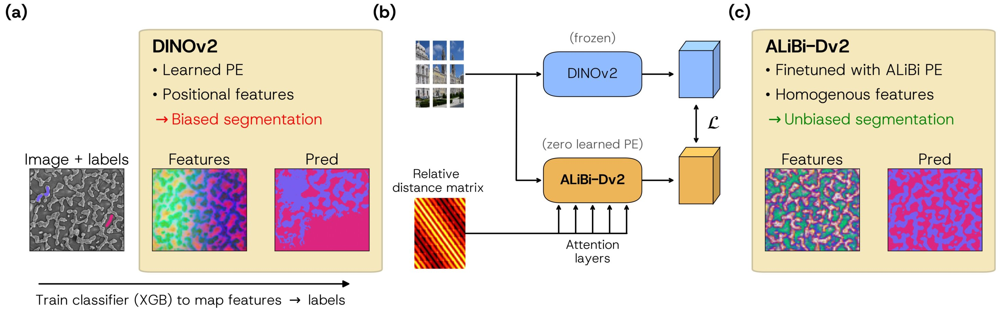

# dino-saw

[](https://arxiv.org/abs/2603.16840)
[](https://huggingface.co/rmdocherty/dino-saw)
[](https://zenodo.org/records/21627644)

<p align="center">
    
</p>


The features of Vision Transformers (ViT) like DINOv2 exhibit certain positional biases, including some channels that are highly positional. This is problematic for weakly- or unsupverised downstream tasks that use these features, like k-means clustering or trainable segmentation. 
To combat this, we remove the ViT's learned positional encoding and replace it with 2D aware ALiBi relative distance-based attention offsets. 
This is a pretty destructive action - the positional encoding is injected at the very start of the model - so to recover previous behaviour we finetune this ALiBi-DINOv2 to target the original embeddings.  
This 'retrofit via distillation' works surprisingly well, and produces a model whose features are more homogeneous (i.e. free of positional bias), which improves subsequent segmentations of homogenous electron microscopy data.

## Contents

- [Installation](#installation)
- [Checkpoints](#checkpoints)
- [Usage](#usage)
- [Project structure](#project-structure)
- [Tests](#tests)
- [Citation](#citation)

## Installation

Download the source and install the package locally:
```bash
git clone https://github.com/tldr-group/dino-saw
pip install --group paper # requires pip>=25
git clone https://github.com/facebookresearch/dinov3 models/dinov3 # required to use alibi-dv3
```
Instead of `pip`, I recommend using `uv` for this: 
```
curl -LsSf https://astral.sh/uv/install.sh | sh # install uv
uv sync --extra paper
```

To get the models, run `download_chkpoints.sh`, or download from the [zenodo](https://huggingface.co/rmdocherty/dino-saw) and place in `models/checkpoints/trained`:
```bash
chmod +x download_chkpoints.sh
./download_chkpoints.sh
```

To get the data needed to run all the figures, you need to download and unzip the data from the zenodo to `notebooks/paper_figures/data`.
```bash
curl -L -o data.zip "https://zenodo.org/records/21627644/files/data.zip?download=1"
unzip -q data.zip -d notebooks/paper_figures_pdf/data
rm data.zip
```
Note: some of the figures rely on ablation checkpoints that aren't in the HF repo (to keep download size small). If you're interested, contact me and I'll send you the checkpoints.

## Checkpoints

We've trained a series models with this setup, all ViT-S DINO models. `_coco` refers to models trained using embeddings from the COCO-stuff (~120k images) dataset, otherwise ImageNetReduced (25k images) was used.

- [alibi_dv2_vits14_reg4.pth](https://huggingface.co/rmdocherty/dino-saw/blob/main/alibi_dv2_vits14_reg4.pth.pth)
- [alibi_coco_dv2_vits14_reg4.pth](https://huggingface.co/rmdocherty/dino-saw/blob/main/alibi_coco_dv2_vits14_reg4.pth)
- [nope_coco_dv2_vits14_reg4.pth](https://huggingface.co/rmdocherty/dino-saw/blob/main/nope_coco_dv2_vits14_reg4.pth)
- [alibi_coco_dv3_vits16_plus_reg4.pth](https://huggingface.co/rmdocherty/dino-saw/blob/main/alibi_coco_dv3_vits16_plus_reg4.pth)


## Usage

Check out `apply.py` or `notebooks/examples/compare_models.ipynb` for usage examples.

## Project structure

This project uses two external dependencies I wrote - [`interactive-seg-backend`](github.com/tldr-group/interactive-seg-backend), for scriptable handling of [weka-style](https://imagej.net/plugins/tws/) interactive segmentation, and [`pretrainedvitwrapper`](https://github.com/rmdocherty/PretrainedViTWrapper), a lightweight library for wrapping ViT feature extraction from timm and DINOv3-style models. Otherwise, it's fairly self-contained:


```bash
notebooks/
├─ examples/ # basic usage exampple
├─ paper_figures_pdf/ # notebooks to re-create paper figures
│  ├─ data/
│  ├─ 01_summary.ipynb
│  ├─ ...
models/ 
├─ checkpoints/ # checkpoints
│  ├─ trained/
│  │  ├─ alibi_dv2_vits14_reg.pth
│  │  ├─ ...
├─ dinov3/ # repo source code (from `git clone https://github.com/facebookresearch/dinov3`)
dinosaw/
├─ utils.py
├─ alibi_logic.py # distance matrix code, custom attention, model
├─ linear_probe.py # for linear probing logic
├─ train/
│  ├─ train.py # simple train loop & config
├─ datasets/
│  ├─ joint_embed_dataset.py
├─ benchmarks/ # for VOC/ADE segmentation
├─ wrappers/ # wrappers for external models / debiasing approaches
```

## Tests

Tests are pretty minimal but just run
```bash
pytest
```
from the root directory.

## Citation
If you found the work useful, please cite:

```bibtex
@misc{pawlowsky2026dinosawalibipositional,
      title={What DINO saw: ALiBi positional encoding reduces positional bias in Vision Transformers}, 
      author={Moritz Pawlowsky and Antonis Vamvakeros and Alexander Weiss and Anja Bielefeld and Samuel J. Cooper and Ronan Docherty},
      year={2026},
      eprint={2603.16840},
      archivePrefix={arXiv},
      primaryClass={cs.CV},
      url={https://arxiv.org/abs/2603.16840}, 
}
```
